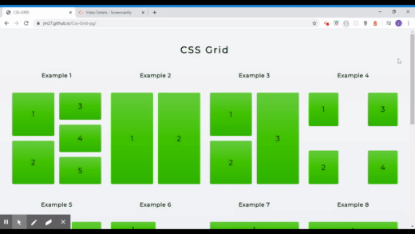

# Css-Grid-pg

* Playground for Css Grid, An application with 10 different CSS Grid examples. 

## Getting Started

* Installing
Follow the instructions in this section to get the app setup to run on your machine.

Clone the git project to your machine (example below is using ssh)

git clone git@github.com:jm27/css-grid-pg.git

## Demo

There is a demo of this app available on github. You can interact with the app and see the full functionality. 

## Visit Demo Site

[CSS-GRID-Playground LINK](https://jm27.github.io/Css-Grid-pg/ "Homepage")
======

## Built With

* HTML.
* CSS.

## Versioning
CSS Grid playground V1.1

## Authors

* **Jesus Esquer** - *Main Contributor* - [jm27](https://github.com/jm27)

## Acknowledgments

* Thanks to Classmates, Instructors, and TA's .
* Bootcamp 2019-2020.
